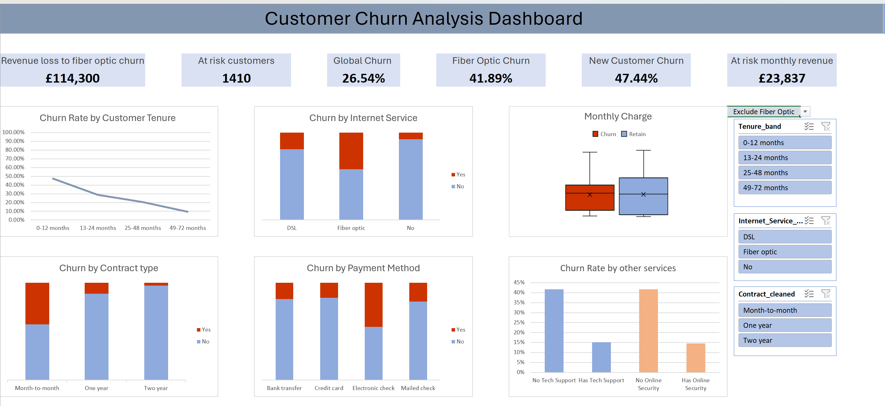
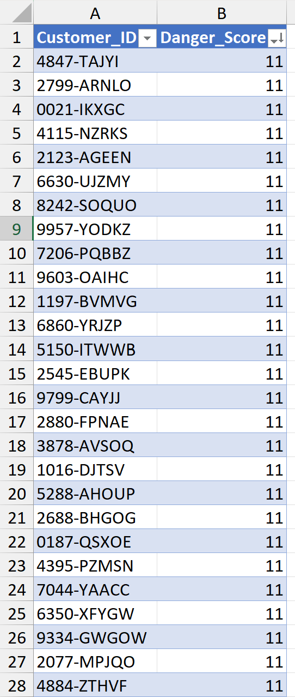

# Excel-Customer-Churn-Interactive-Dashboard
End-to-end churn analysis for a telco dataset, from raw data cleaning through to an interactive Excel dashboard and at-risk customer scoring model. The focus of the project was a data driven investigation into the reasons why customers choose to leave. 

### Objectives
- Clean and prepare raw customer data for analysis
- Engineer features that better capture churn risk than the raw fields alone
- Explore churn drivers through pivot table analysis
- Build an interactive dashboard for non-technical stakeholders to explore the data themselves
- Produce a prioritised list of at-risk customers for a retention team to act on

### Data Cleaning & Feature Engineering

Raw customer data was cleaned and enriched with two custom engineered columns:

- Services_Count — total number of add-on services a customer is subscribed to, used as a proxy for account engagement/stickiness
- Danger_Score — a composite risk score built from multiple churn-correlated factors, used to rank customers by likelihood of leaving

### Exploratory Analysis 

Pivot tables were used to explore churn rates across contract type, tenure, payment method, and service usage, surfacing the strongest churn indicators before building the dashboard.

### Interactive Dashboard

The dashboard uses slicers and dynamic `FILTER` formulas so a user can explore churn patterns live: filtering by contract type, tenure band, or service usage and watching the underlying charts and customer lists update in real time.

### At-Risk Customer List

Using the Danger_Score model, the analysis identified 291 customers scoring 9+. This is a prioritised shortlist for targeted retention outreach.

### Presentation

Findings were packaged into a 12-slide stakeholder presentation, first building the case for why churn is happening before revealing who is most at risk and what to do about it.

#### Tools Used

- Excel: data cleaning, pivot tables, dynamic dashboard
- Powerpoint: stakeholder presentation

## Repo contents 

  telco-churn-dashboard/
├── README.md
├── Telco_Churn_Dashboard.xlsx
├── Telco_Churn_Presentation.pptx
├── screenshots/
│   ├── dashboard_overview.png
│   ├── at_risk_customers.png
└── data/
    └── telco_churn_raw.csv

### How to Use

Download `Telco_Churn_Dashboard.xlsx` and enable editing/macros to interact with the slicers and filters directly. Static previews of each view are shown above for anyone who just wants a quick look.

#### Author

Valentin Hristov - Data Analytics Trainee, Rockborne
